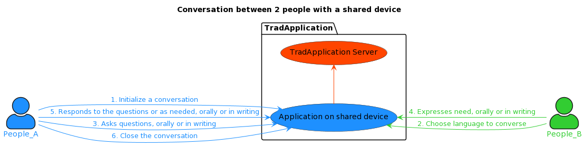
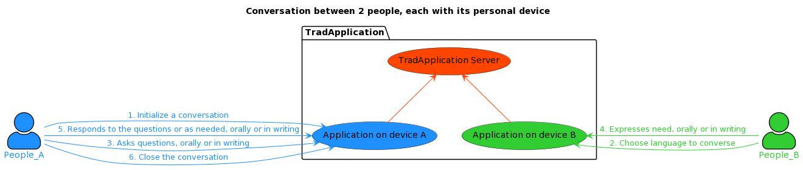
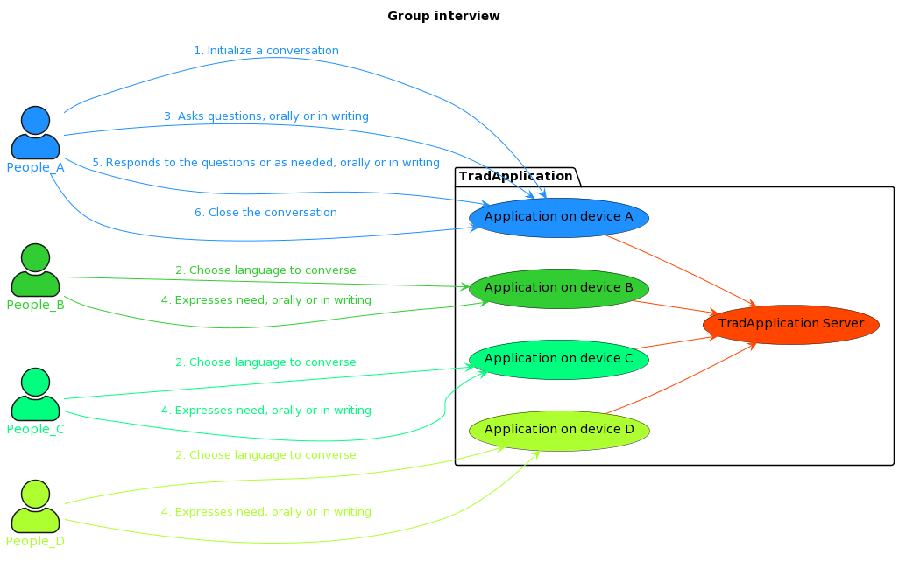
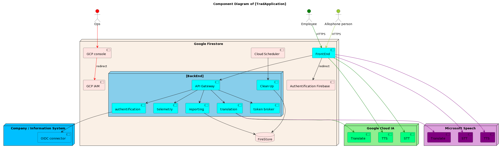
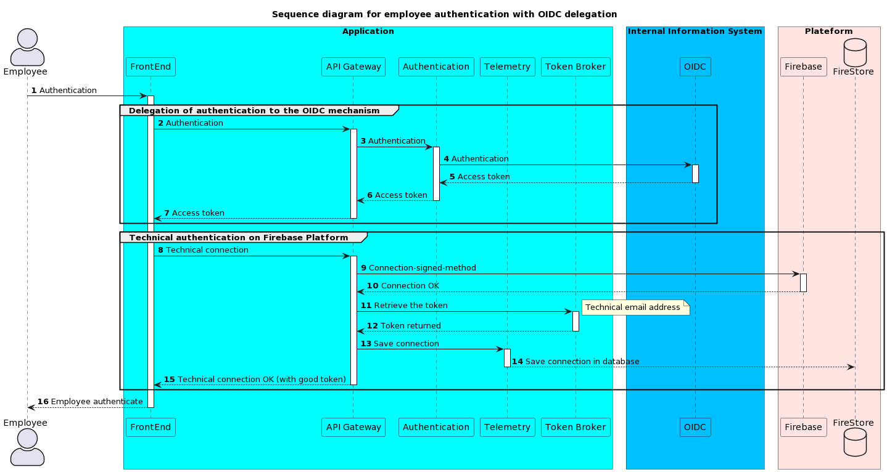
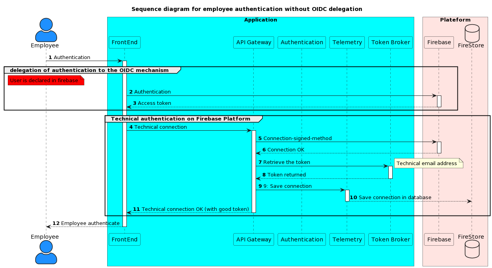
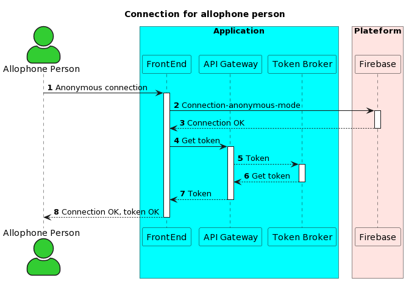
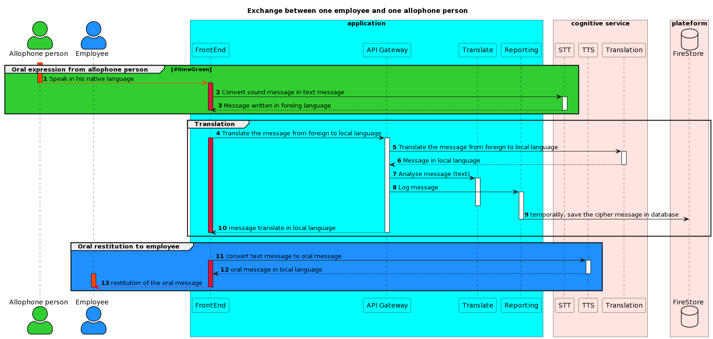

# Objective of the [TradEmploi] application

- The objective of the application is to provide an instantaneous translation between two people, one of whom is allophone.
- The added value of this application is to allow a use in a company receiving a public not mastering the fluent language of the country, and to offer  a quality service to an allophone person. 
- This application is based on cognitive services, the selection of these services is configurable according to the best translation scores.
- The application can be used on a single device, or on two different devices, and even in a conversation group mode.

# Use case

## Use Case 1: Using a shared device
In this context, *People_A* and *People_B* don’t speak the same language (fluent or academic); People_B is allophone. They use a **shared device**!

## Use Case 2: Using its own device
The difference between the precedent use case, *People_A* and *People_B* use their **own device**.

## Use Case 3: Group Interview
In this use-case, we make a group interview, each participant use own device.

# Architecture

The main components are described follow:

|Component|Typology|Role|
|---------|---------|----|
| Google FireStore | | Platform |
 | GCP Console | supervisory console | only for admin; need an accont on GCP |
 | GCP IAM | IAM | In this IAM, we declare ops / admin account, and technical account |
 | Cloud Scheduler | Cron | Used to execute **Clean Up** component |
| Authenticfication Firebase | IAM | **Technical authentification** to use cognitives service |
 | FireStore | database, managed by Google | Store temporarily conversations; store permantly indicators |
 | Clean Up | Applicative component | batch to clean tables from FireStore (deletes conversation) |
| Token Broker | Applicative component | Service to deliver a token to permit to use the application |
 | Telemetry | Applicative component | Service to collect indicators |
| Reporting | Applicative component | Applicative log, conversation are store in database (

# Other explanations

## Connection of an employee to the application

To connect an employee to the application, you have the choice:
1. You can use your authentication system, if it respects the OIDC protocol

2. You can use the Firebase authentication, but you must declare people in Firebase.

# Connection of the allophone people to the application

To connect the allophone people, we use an anonymous connection (the allophone person is not declared in our information system or in firebase!)

## Translation

We describe below a simple conversation....

